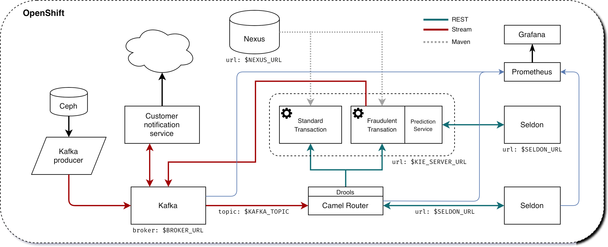
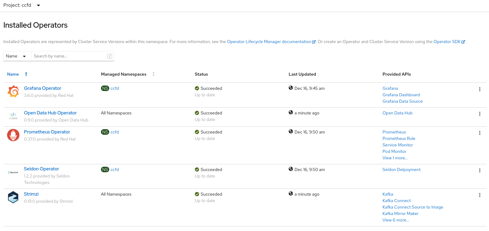

# Workshop: Fraud Detection with Open Data Hub

#### <i>A Microsoft workshop from the SQL Server team, in partnership with Red Hat</i>

<p style="border-bottom: 1px solid lightgrey;"></p>

 <h2>06 Credit Card Fraud Detection</h2>

In this workshop, you'll learn how to deploy Open Data Hub in your OpenShift environment, and use some of the tools it provides to implement a  Fraud Detection use case scenario, based on the model you trained in the other parts of this workshop series.

This demo will implement the following scenario:



* Credit card transactions simulations are stored in a Ceph object storage (S3-Compatible).
* Simulated transactions are sent by a Kafka producer to a Kafka instance.
* A Camel Router, using the model previously trained, classifies the transaction (standard or fraudulent) and forwards it to the KIE Server.
* Fraudulent transactions are checked again using a prediction service.
* Fraudulent transactions are sent back to Kafka, and a customer notification service is simulated to take action.
* All this workflow is fully instumented with Prometheus, and Grafana dashboards display transaction flows, classifications, model performance,...

This worshop will guide you through the implementation of all this elements!

<h2>6.1  OpenShift and CCFD project</h2>

<p><b>Activity: Create a project</b></p>

*Warning 1*: As we will deploy operators in the environment, you must be cluster-admin, or have sufficient rights in OpenShift to do this.

*Warning 2*: All the commands and configuration files used in the workshop are using this project name: `ccfd`. If you use another one, please amend the commands and files as necessary.

First, create a project for this demo. We will use **ccfd** (Credit Card Fraud Detection).

You can create it through the OpenShift Console (the UI), or with this command using the `oc` client:

```bash
oc new-project ccfd
```

<h2>6.2  Open Data Hub</h2>

<p><b>Activity: deploy the operator</b></p>

Using the OpenShift Console UI, the Open Data Hub (ODH) operator can be deployed through OperatorHub.

If you prefer to use the CLI, you can use the file from the `deploy` folder at the root of the repository:

```bash
oc apply -f deploy/odh/operator.yaml
```

After a few seconds, you can check the operator installation with:

```bash
oc get crd kfdefs.kfdef.apps.kubeflow.org
```

which should return:

```bash
NAME                             CREATED AT
kfdefs.kfdef.apps.kubeflow.org   xxxxxxxxxxxx
```
<p><b>Activity: deploy Open Data Hub</b></p>

Now that the operator is running, we can deploy our instance of ODH in our ccfd project. This deployment will include:

* Kafka
* Seldon
* Prometheus
* Grafana

*Warning*: the Open Data Hub (ODH) operator can deploy the Strimzi operator that will handle the deployment of the Kafka cluster. However, if Strimzi or AMQ Streams are already present on your cluster, deploying it again may create issues. Therefore, 2 different versions of the ODH deployment are provided, with or without the Strimzi operator deployment. Choose according to your configuration.

If you don’t already have the Strimzi operator or AMQ Streams

```bash
oc apply -n ccfd -f deploy/odh/odh-with-strimzi.yaml
```

If you don’t need to deploy the Strimzi operator (you already have it or AMQ Streams)

```bash
oc apply -n ccfd -f deploy/odh/odh-no-strimzi.yaml
```

ODH deployment is ready when you have this in the Installed Operators panel:



Operators
and you have those pods running (ids will of course be different):

```bash
> oc get pods -n ccfd

NAME                                               READY   STATUS    RESTARTS   AGE
grafana-deployment-9f8c5df68-gdbpf                 1/1     Running   0          46m
grafana-operator-7755cb4b8-b7mlf                   1/1     Running   0          46m
odh-message-bus-entity-operator-84f96c5784-kqrn5   3/3     Running   0          45m
odh-message-bus-kafka-0                            2/2     Running   0          46m
odh-message-bus-kafka-1                            2/2     Running   0          46m
odh-message-bus-kafka-2                            2/2     Running   0          46m
odh-message-bus-zookeeper-0                        1/1     Running   0          46m
odh-message-bus-zookeeper-1                        1/1     Running   0          46m
odh-message-bus-zookeeper-2                        1/1     Running   0          46m
prometheus-operator-7b88c94585-d8hjn               1/1     Running   0          42m
prometheus-prometheus-0                            3/3     Running   1          41m
seldon-controller-manager-7ff8d49d55-tj2gj         1/1     Running   0          42m
```

<h2>6.2  Rook Ceph</h2>

Rook-Ceph is the solution that will provide Object Storage to store some data used in the workshop.
These steps will deploy Rook-Ceph at version v1.5.10

<p><b>Activity: deploy the operator</b></p>

Create namespace, CRDs, Accounts and Security items:

```bash
oc apply -f https://github.com/rook/rook/raw/v1.5.10/cluster/examples/kubernetes/ceph/common.yaml
```

Deploy the operator:

```bash
oc apply -f https://github.com/rook/rook/raw/v1.5.10/cluster/examples/kubernetes/ceph/operator-openshift.yaml
```

The next command to create the rook-ceph cluster itself is **valid only** for **OpenShift deployment in AWS**.

Deploy the rook-ceph cluster on AWS (including RHPDS or OpenTLC environments):

```bash
oc apply -f https://github.com/rook/rook/raw/v1.5.10/cluster/examples/kubernetes/ceph/cluster-on-pvc.yaml
```

*Tip*: if you are not running on AWS, you must adapt [this file](https://github.com/rook/rook/raw/v1.5.10/cluster/examples/kubernetes/ceph/cluster.yaml) to your configuration before applying it.

The rook-ceph cluster will take a few minutes to deploy. You can monitor the deployment in the rook-ceph namespace and wait to have 3 pods named rook-ceph-osd-xxxxx running:

```bash
> oc get pods -n rook-ceph | grep rook-ceph-osd-[0-9.]
rook-ceph-osd-0-5b8587c958-tq7fn                            1/1     Running     0          72s
rook-ceph-osd-1-6fd6676658-vvb92                            1/1     Running     0          70s
rook-ceph-osd-2-7bcd559d79-v8csc                            1/1     Running     0          69s
```

Once the Ceph cluster is ready, you can create the Object Store.

<p><b>Activity: deploy the ObjectStore</b></p>

```bash
https://github.com/rook/rook/raw/v1.5.10/cluster/examples/kubernetes/ceph/object.yaml
```

You can verify the Object Store and the Rados Gateway pod (the component providing the S3 interface) are Ok with this:

```bash
> oc -n rook-ceph get pods | grep rgw
rook-ceph-rgw-my-store-a-6d7df9db-nlbns                     1/1     Running     0          79s
```

To acces the object store externally, you must create a route to the rook service, rook-ceph-rgw-my-store (in the rook-ceph namespace) to expose the endpoint. This endpoint url will be used to access the S3 interface from the example notebooks.

Create the route:

```bash
oc expose -n rook-ceph --name='s3' svc/rook-ceph-rgw-my-store
```

Your Route will be in the form http://s3-rook-ceph.apps.<Name_of_your_cluster>;. You can get it with this command:

```bash
echo http://$(oc get route -n rook-ceph | grep s3 | awk '{print $2}')
```

Create now the Bucket Storage Class, which will allow easy provisioning of buckets later on.

Create the Storage Class:

```bash
oc apply -f https://github.com/rook/rook/blob/v1.5.10/cluster/examples/kubernetes/ceph/storageclass-bucket-delete.yaml
```

<h2>6.3  Fraud Detection Model</h2>

In the previosu workshops, we already have trained a fraud detection model. You can now deploy with the Seldon operator (part ODH), using the file deploy/model/modelfull.yaml in this repository.

<p><b>Activity: Deploy the Fraud Detection model with Seldon</b></p>

```bash
oc apply -n ccfd -f deploy/model/modelfull.yaml
```

Check and make sure the model is created (this step will take a couple of minutes):

```bash
oc -n ccfd get seldondeployments
oc -n ccfd get pods | grep modelfull
```

You should have a pod named modelfull-modelfull-0-modelfull-xxxxxxxxx with the Running status, and 2/2 pods.

Now create a route to access the model by using the file deploy/model/modelfull-route.yaml in this repo:

```bash
oc apply -n ccfd -f deploy/model/modelfull-route.yaml
```

Your model is now served from an externally accessible endpoint. You can get its address with this command:

```bash
echo http://$(oc get route -n ccfd | grep modelfull | awk '{print $2}')
```

Example result: http://modelfull-ccfd.apps.cluster-dae8.dae8.example.opentlc.com

You can now test the model with this command. You should get the exact same result:

Query:

```bash
curl -X POST -H 'Content-Type: application/json' -d '{"strData": "0.365194527642578,0.819750231339882,-0.5927999453145171,-0.619484351930421,-2.84752569239798,1.48432160780265,0.499518887687186,72.98"}' http://$(oc get route -n ccfd | grep modelfull | awk '{print $2}')/api/v1.0/predictions
```

Result:

```bash
{"data":{"names":[],"tensor":{"shape":[1],"values":[0]}},"meta":{"metrics":[{"key":"V3","type":"GAUGE","value":0.365194527642578},{"key":"V4","type":"GAUGE","value":0.819750231339882},{"key":"V10","type":"GAUGE","value":-0.5927999453145171},{"key":"V11","type":"GAUGE","value":-0.619484351930421},{"key":"V12","type":"GAUGE","value":-2.84752569239798},{"key":"V14","type":"GAUGE","value":1.48432160780265},{"key":"V17","type":"GAUGE","value":0.499518887687186},{"key":"Amount","type":"GAUGE","value":72.98},{"key":"proba_1","type":"GAUGE","value":0.052660697016054275}]}}
```

Finally, enable Prometheus metrics scraping by deploying a ServiceMonitor for the Seldon service (general metrics), and a PodMonitor for the custom metrics we are exposing:

```bash
oc apply -n ccfd -f deploy/model/modelfull-servicemonitor.yaml
oc apply -n ccfd -f deploy/model/modelfull-custom-metrics-monitor.yaml
```

<h2>6.4  Upload data to Rook-Ceph</h2>

<p><b>Activity: Bucket creation though Object Bucket Claims</b></p>

We will store our base data in an Object Store bucket. There are many ways to create a bucket, but here is a method using an Object Bucket Claim. With Rook-Ceph that we deployed earlier, you can use this configuration:

Create bucket with Rook-Ceph:

```bash
oc apply -n ccfd -f deploy/storage/obc-rook.yaml
```

You can now retrieve the informations needed to connect to the storage.

You can find this information through the OCP console, in the "Config Maps" and "Secrets" sections for the ccfd (selecting ccdata and clicking on "Reveal values"), or do this through the CLI:

Access Key:

```bash
oc get secret/ccdata -o yaml | grep [^:]AWS_ACCESS_KEY_ID | awk '{print $2}' | base64 -d -
```

Secret Key:

```bash
oc get secret/ccdata -o yaml | grep [^:]AWS_SECRET_ACCESS_KEY | awk '{print $2}' | base64 -d -
```

Bucket name:

```bash
oc get cm/ccdata -o yaml | grep [^:]BUCKET_NAME | awk '{print $2}'
```

Host (Internal access):

```bash
oc get cm/ccdata -o yaml | grep [^:]BUCKET_HOST | awk '{print $2}'
```

Host (External access):

```bash
echo http://$(oc get -n rook-ceph route/s3 -o yaml | grep -m 1 '[^\-] host:' | awk '{print $2}')
```

Create a Secret to store your keys
This secret will be used later on by the pods that need access to S3, like the Kafka Producer.

```bash
oc create secret generic keysecret -n ccfd --from-literal='accesskey=<Replace with Access Key>' --from-literal='secretkey=<Replace with Secret Key>'
```

*Tip*: If you have created your bucket through an Object Bucket Claim you can directly do this in one line:

```bash
oc create secret generic keysecret -n ccfd --from-literal="accesskey=$(oc get secret/ccdata -o yaml | grep [^:]AWS_ACCESS_KEY_ID | awk '{print $2}' | base64 -d -)" --from-literal="secretkey=$(oc get secret/ccdata -o yaml | grep [^:]AWS_SECRET_ACCESS_KEY | awk '{print $2}' | base64 -d -)"
```

<p><b>Activity: Upload data to your S3 bucket
</b></p>

Now that you have all the necessary information, you can upload data to your newly created bucket. Again, there are many ways to do that, but here is an example using the aws client.

If you don’t have the aws client already you can install it from here.

Method 1: Configure manually the client (Only enter key and secret, leave all other fields as default)

```bash
aws configure
```

Method 2: One line configuration

```bash
aws configure set aws_access_key_id $(oc get secret/ccdata -o yaml | grep [^:]AWS_ACCESS_KEY_ID | awk '{print $2}' | base64 -d -) & aws configure set aws_secret_access_key $(oc get secret/ccdata -o yaml | grep [^:]AWS_SECRET_ACCESS_KEY | awk '{print $2}' | base64 -d -)
```

Check if connection is working using the route (you can use oc get route -n rook-ceph):

```bash
aws s3 ls --endpoint-url <S3_ENDPOINT_URL>
```

or directly:

```bash
aws s3 ls --endpoint-url http://$(oc get -n rook-ceph route/s3 -o yaml | grep -m 1 '[^\-] host:' | awk '{print $2}')
```

It should return something like: `2020-12-16 11:33:56 ccdata-88a98651-6afc-405a-9c28-e49063ad28c5`.

*Warning*: For the previous command and all others using the aws client: if your endpoint is using SSL (starts with https) but your OpenShift installation has not been done with recognized certificates, you must add --no-verify-ssl at the end of all your commands.

Now, copy the credit card transaction creditcard.csv file (available here) and upload it using (replace < > vars):

```bash
wget -qO- https://s3.amazonaws.com/com.redhat.csds.odh.tutorial-data/data_creditcard.csv | aws s3 cp - --endpoint-url <S3_ENDPOINT_URL> s3://<s3_bucket>/OPEN/uploaded/creditcard.csv --acl public-read-write
```

e.g.: `wget -qO- https://s3.amazonaws.com/com.redhat.csds.odh.tutorial-data/data_creditcard.csv | aws s3 cp - --endpoint-url https://s3-rook-ceph.apps.perf3.ocs.lab.eng.blr.redhat.com s3://ccdata-5a225950-c53c-4f10-af42-f49c3c29d03a/OPEN/uploaded/creditcard.csv --acl public-read-write`

*Tip*: you can do this in one (long…​) command by using all the commands we’ve seen previously in substitution mode:

```bash
wget -qO- https://s3.amazonaws.com/com.redhat.csds.odh.tutorial-data/data_creditcard.csv | aws s3 cp - --endpoint-url http://$(oc get -n rook-ceph route/s3 -o yaml | grep -m 1 '[^\-] host:' | awk '{print $2}') s3://$(oc get -n ccfd cm/ccdata -o yaml | grep [^:]BUCKET_NAME | awk '{print $2}')/OPEN/uploaded/creditcard.csv --acl public-read-write
```

Verify the file is uploaded using:

```bash
aws s3 ls s3://<s3_bucket>/OPEN/uploaded/ --endpoint-url <ROOK_CEPH_URL>
```

Or with one line again:

```bash
aws s3 ls s3://$(oc get -n ccfd cm/ccdata -o yaml | grep [^:]BUCKET_NAME | awk '{print $2}')/OPEN/uploaded/ --endpoint-url http://$(oc get -n rook-ceph route/s3 -o yaml | grep -m 1 '[^\-] host:' | awk '{print $2}')
```

Both commands flavours should return: `XXXX-XX-XX XX:XX:XX 150259138 creditcard.csv`

<h2>6.5  KIE Server</h2>

<p><b>Seldon model for the prediction service</b></p>

In order to use jBPM’s prediction service from User Tasks, a second Seldon model must be deployed using:

```bash
oc new-app quay.io/odh-workshops/ccfd-business-workflow-tutorial-ccfd-seldon-usertask-model:1.1-CCFD
```

<p><b>Execution server</b></p>

To deploy the KIE server you can use the deploy/ccd-service.yaml on this repo and run:

```bash
oc apply -f deploy/ccd-service.yaml -n ccfd
```

The KIE server can be configured by editing the enviroment variables in that file, under the env key. Some configurable values are:

SELDON_URL, location the Seldon server providing fraudulent score prediction

CUSTOMER_NOTIFICATION_TOPIC, Kafka topic for outgoing customer notifications

BROKER_URL, Kafka broker location and port

<p><b>Execution server optional configuration</b></p>

If the Seldon server requires an authentication token, this can be passed to the KIE server by adding the following environment variable to deploy/ccd-service.yaml:

```yaml
- name: SELDON_TOKEN
  value: <SELDON_TOKEN>
```

By default, the KIE server will request a prediction to the endpoint <SELDON_URL>/predict. If however, your Seldon deployment uses another prediction endpoint, you can specify it by adding the SELDON_ENDPOINT enviroment variable, for instance:

```yaml
- name: SELDON_ENDPOINT
  value: 'api/v0.1/predictions'
```

The HTTP connection parameters can also be configured, namely the connection pool size and the connections timeout. The timeout value provided is treated as milliseconds. For instance:

```yaml
- name: SELDON_TIMEOUT
  value: '5000' # five second timeout
- name: SELDON_POOL_SIZE
  value: '5' # allows for 5 simulataneous HTTP connections
```

The prediction service’s confidence threshold, above which a prediction automatically assigns an output and closes the user task can be also provided. It is assumed to be a probability value between 0.0 and 1.0. If not provided, the default value is 1.0. To specify it use:

```yaml
- name: CONFIDENCE_THRESHOLD
  value: '0.5' # as an example
```

If you want to interact with the KIE server’s REST interface from outside OpenShift, you can expose its service with

```bash
oc expose svc/ccd-service
```

<h2>6.6  Notification Service</h2>

The notification service is an event-driven micro-service responsible for relaying notifications to the customer and customer responses.

If a message is sent to a "customer outgoing" Kafka topic, a notification is sent to the customer asking whether the transaction was legitimate or not. For this demo, the micro-service simulates customer interaction, but different communication methods can be built on top of it (email, SMS, etc).

If the customer replies (in both scenarios: they either made the transaction or not), a message is written to a "customer response" topic. The router (described below) subscribes to messages in this topic, and signals the business process with the customer response. To deploy the notification service, we use the image ccfd-notification-service (available [here](https://quay.io/repository/odh-workshops/ccfd-business-workflow-tutorial-ccfd-notification-service)), by running:

```bash
oc apply -f deploy/notification-service.yaml -n ccfd
```

<h2>6.7  Camel Router</h2>

The [Apache Camel](https://camel.apache.org/) router is responsible consume messages arriving in specific topics, requesting a prediction to the Seldon model, and then triggering different REST endpoints according to that prediction.

The route is selected by executing configurable [Drools](https://www.drools.org/) rules using the model’s prediction as inout. Depending rules outcome a specific business process will be triggered on the KIE server.

To deploy a router with listens to the topic KAFKA_TOPIC from Kafka’s broker BROKER_URL and starts a process instance on the KIE server at KIE_SERVER_URL, we can use the built image ccd-fuse (available here):

```bash
oc apply -f deploy/router.yaml -n ccfd
```

<h2>6.6  Kafka Producer</h2>

The Kafka Producer needs specific parameters to read from S3 interface and call the model’s REST prediction endpoint.

We will use a template to deploy multiple objects at once. You can either edit the parameters in the deploy/kafka/producer-deployment.yaml in this repository before processing the template, or pass the parameters direcly. The needed parameters are:

`NAMESPACE`: The OpenShift project in use, normally ccfd

`S3ENDPOINT`: The address of your S3 storage, you should use the internal cluster address (normally s3.openshift-storage.svc)

`S3BUCKET`: The name of the bucket created earlier

`FILENAME`: The location of hte creditcard.csv file in the data store (nornmaly OPEN/uploaded/creditcard.csv)

If you have directly modified the producer-deployment.yaml file:

```bash
oc process -f deploy/kafka/producer-deployment.yaml | oc apply -f -
```

If you are passing the parameters:

```bash
oc process -f deploy/kafka/producer-deployment.yaml -p NAMESPACE=<Replace Namespace> -p S3ENDPOINT=<Replace Endpoint> -p S3BUCKET=<Replace Bucket> -p FILENAME=<Replace Filename> | oc apply -f -
```

e.g.: `oc process -f deploy/kafka/producer-deployment.yaml -p NAMESPACE=ccfd -p S3ENDPOINT=http://s3.openshift-storage.svc -p S3BUCKET=ccdata-5a225950-c53c-4f10-af42-f49c3c29d03a -p FILENAME=OPEN/uploaded/creditcard.csv | oc apply -f -`

Automated one-line version:

```bash
oc process -f deploy/kafka/producer-deployment.yaml -p NAMESPACE=ccfd -p S3ENDPOINT=http://$(oc get -n rook-ceph route/s3 -o yaml | grep -m 1 '[^\-] host:' | awk '{print $2}') -p S3BUCKET=$(oc get -n ccfd cm/ccdata -o yaml | grep [^:]BUCKET_NAME | awk '{print $2}') -p FILENAME=OPEN/uploaded/creditcard.csv | oc apply -f -
```

<h2>6.6  Grafana/Prometheus</h2>

Create the Service Monitors needed by Prometheus to scrap metrics from the Kie Server and the Router.

Kie Server Service Monitor:

```bash
oc apply -f deploy/servicemonitors/ccdserviceservicemonitor.yaml
```

Camel Router Service Monitor

```bash
oc apply -f deploy/servicemonitors/ccdfuseservicemonitor.yaml
```

From the Openshift portal, in the Network->Routes section on the left, click on the Prometheus route and explore some of the metrics.

To launch Grafana dashboard click on the Grafana route. You are now able to look at the base dashboards coming with Open Data Hub.

On top of the Kafka monitoring dashboard that comes with Open Data Hub, **deploy the following ones** to see information on our workflow:

* Seldon Core:

```bash
oc apply -f deploy/grafana/seldon-core-dashboard.yaml
```

* Seldon Model Prediction:

```bash
oc apply -f deploy/grafana/seldon-model-prediction.yaml
```

* Kie Server:

```bash
oc apply -f deploy/grafana/kie-dashboard.yaml
```

* Camel Router:

```bash
oc apply -f deploy/grafana/router-dashboard.yaml
```

<p style="border-bottom: 1px solid lightgrey;"></p>

<p><b>For Further Study</b></p>
<ul>
    <li><a href="https://opendatahub.io/docs.html" target="_blank">You can learn more about Open Data Hub and how to ingest a model at this reference.</a></li>
</ul>

Congratulations! You have completed this workshop. You now have the tools, assets, and processes you need to extrapolate this information into other applications.
